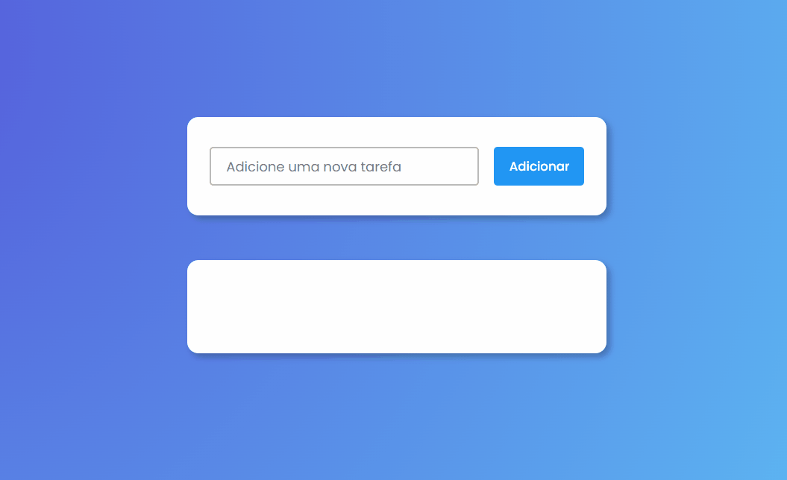

<h1 align="center">To-do List</h1>

Esse projeto é uma lista de tarefas criada para facilitar a organização da rotina dos usuários

    <a href="#sobre">Sobre</a> | <a href="##conceitos">Funcionalidades</a> | <a href="##funcionalidades⚙️">Funcionalidades</a> | <a href="##tecnologias">Tecnologias</a> | <a href="##teste">Teste</a>

# Sobre📖

Esse projeto foi desenvolvido com o intuito de praticar os conceitos básicos e necessários do JavaScript e para um primeiro contato com JSON e Local Storage.

</img>

## Conceitos✏️  

Principais conceitos que foram usados no desenvolvimento do projeto:

<ul>
    <li>Validação de input</li>
    <li>Criação de elementos pelo JavaScript</li>
    <li>Eventos no DOM</li>
    <li>Propriedades e Métodos do DOM</li> 
    <li>Arrays, NodeLists e Iteração com for of</li>
    <li>Local Storage, JSON e Objetos</li> 
    <li>Modal</li>
</ul>

## Funcionalidades⚙️
 - [x] Validação de tarefas
 - [x] Criar tarefas
 - [x] Editar tarefas
 - [x] Completar tarefas
 - [x] Remover tarefas
 - [x] Integração com o Local Storage

## Tecnologias🛠️ 

As seguintes ferramentas foram usadas no desenvolvimento do projeto:

<ul>
    <li>HTML</li>
    <li>CSS</li>
    <li>JavaScript</li>
</ul>

## Teste🔍

Teste a aplicação na sua máquina <a href="to-do-list-app-js.netlify.app">clicando aqui</a>🚀

Feito com 💙 e ☕ por <a href="https://www.linkedin.com/in/geovani-silva-21298921b/" target="_blank">Geovani Silva</a> 
